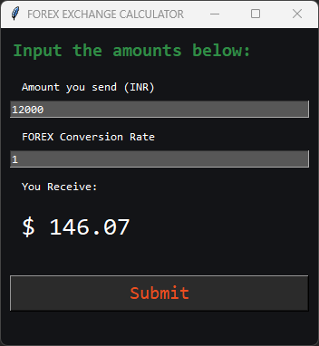

# FOREX EXCHANGE CALCULATOR

> This code is a simple currency exchange calculator program. It's written in Python, using the Tkinter library for GUI. The user inputs the amount of Indian Rupees they want to convert and the conversion rate, then the program calculates and displays the converted amount in US dollars. The conversion rate is fetched from an external API (apilayer). The resulting program creates a GUI with input fields for the amount to be converted and conversion rate, as well as an output field to display the converted amount in US dollars.

- Input the money you want to send in INR, enter the FOREX conversion rate that you bank applies, get the expected amount (USD) you may receive.

